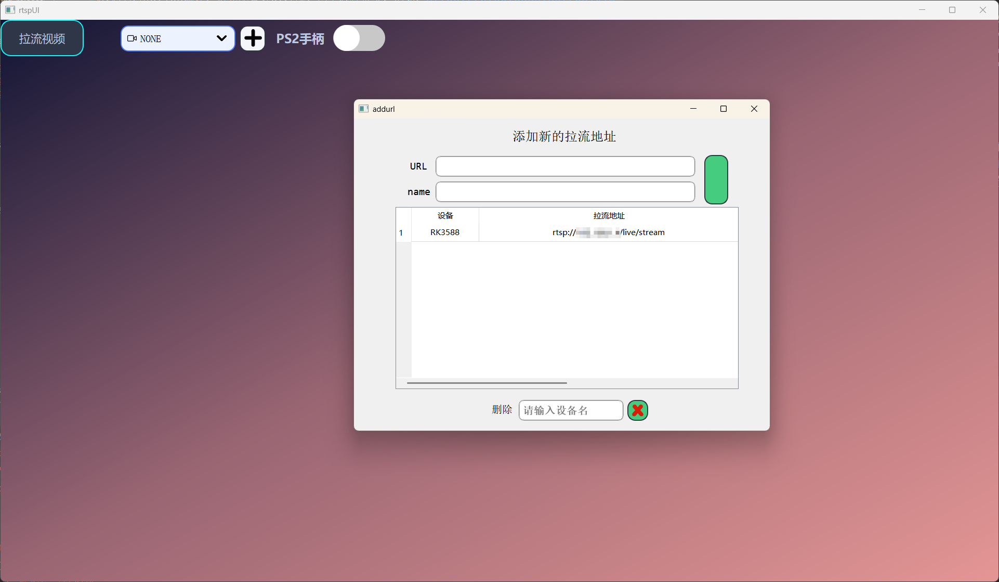
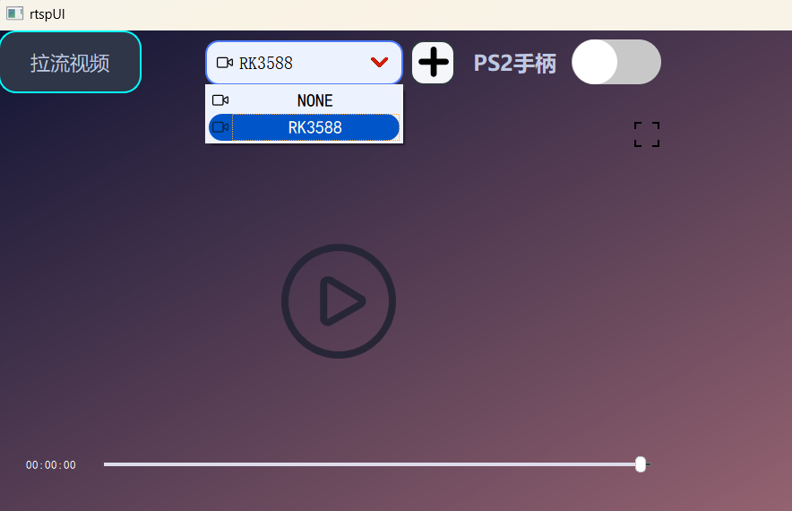

# pull_the_video_stream 如果不想配置qt环境，你也可以选择其他的播放器，VLC，ffplay命令（不过这两个延迟会很高）
- 该项目使用clion编译，请先配置好qt环境，网上教程很多，例如：https://blog.csdn.net/weixin_55486665/article/details/147849307
- 记得配置qt的外部工具uic和designer，有两个ui文件用的到
- 这里面有些小操作（视频框右键点击，还有之前本来想顺便用于有PS2手柄控制车的，后面懒得实现了），不过有些bug，不过不影响主要的拉流
- 还有个问题是ffmpeg库，avformat_open_input函数会是一直阻塞等待，没找到方法可以超时退出
# 文件 
- addURL：用于添加拉流地址的界面
- listNode：用于管理视频界面的链表（这是之前学链表写的，现在来看不如用现成的）
- mySerialPort：与拉流无关，之前用于外接串口的
- rtspUI：主界面，像pushBtn，switchBtn和videoScrollArea都没用到，主要就是rtspui.cpp和rtspui.ui
- videoWin：拉流显示
- rtsp.cpp：拉流线程
# 运行效果

## 个人能力有限，记得点赞